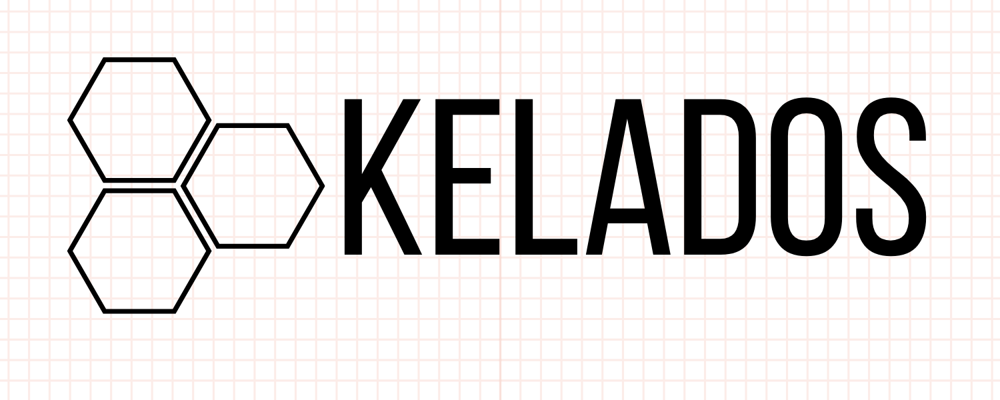

<p align="center">
  
</p>

<h1 align="center">Kelados</h1>

<p align="center">
  <strong>Free, unlimited, open-source text-to-speech that runs on your own device.</strong><br />
  An open, free text-to-speech platform, with a studio for creators and an SDK for developers.
</p>

<p align="center">
  <a href="https://www.npmjs.com/package/kelados"></a>
  <a href="./LICENSE"></a>
  
  
</p>

<p align="center">
  <a href="#features">Features</a> ·
  <a href="#how-it-works">How it works</a> ·
  <a href="#quick-start">Quick start</a> ·
  <a href="#use-it-in-your-project">SDK & API</a> ·
  <a href="#self-hosting">Self-hosting</a> ·
  <a href="./DEPLOYMENT.md">Deployment</a>
</p>

---

## Why Kelados?

Hosted voice platforms charge per character because **their** GPUs generate every second of audio. Kelados moves that work onto the device that needs the audio: the visitor's browser, your laptop or your own server. Running it costs nobody anything, which makes it:

- **Unlimited.** No credits, quotas or character caps.
- **Private.** Text and audio never leave the machine that generates them.
- **Free to operate.** The hosted platform runs entirely on free tiers.
- **Open.** MIT-licensed code with Apache-2.0 model weights. Fork it, self-host it, ship it.

## Features

| | |
|---|---|
| **Speech Studio** | Turn anything from a sentence to a novel into natural speech. Playback starts while the rest is still generating, with speed control, history and WAV export. |
| **Long-form Projects** | Build multi-voice audiobooks, podcasts and voiceovers. Cast a voice per block, set pauses, import dialogue scripts (`ALEX: Hello!`) and master to a single file. |
| **Voice Library** | 28 American and British English voices, previewed live on your device. |
| **Speech to Text** | Whisper in the browser: transcripts in 99 languages, translation to English, SRT/VTT subtitle export and microphone recording. |
| **Pronunciation Rules** | Teach every voice how to say brand names, acronyms and jargon. Rules apply everywhere: web, SDK and CLI. |
| **Voice Presets** | Save named voice and speed combinations and use them from the studio or from code. |
| **Developer Platform** | A Node SDK, a CLI, a drop-in compatible self-hosted server, API keys and a usage dashboard. |

## How it works

```
┌──────────────────────────────┐        ┌────────────────────────────┐
│  Browser / your server       │        │  Kelados API (optional)    │
│                              │        │  Express + MongoDB         │
│  Kokoro-82M (ONNX)           │ counts │                            │
│  WebGPU · WASM · CPU         │───────▶│  accounts · API keys       │
│                              │        │  projects · presets        │
│  text ──▶ audio, locally     │◀───────│  lexicon · usage stats     │
└──────────────┬───────────────┘ sync   └────────────────────────────┘
               │ model weights (once, then cached)
        ┌──────┴───────┐
        │ Public CDNs  │  Hugging Face · jsDelivr
        └──────────────┘
```

- **Synthesis** uses [Kokoro-82M](https://huggingface.co/hexgrad/Kokoro-82M), a compact, high-quality TTS model, run with [transformers.js](https://github.com/huggingface/transformers.js) in a Web Worker (WebGPU when available, WASM otherwise) or on CPU in Node.
- **Transcription** uses Whisper through the same runtime.
- **The API** never receives text or audio. It stores only optional account data and per-day character counts.

## Repository structure

```
kelados/
├── frontend/   Next.js 16 · TypeScript · Tailwind CSS v4 (static export)
├── backend/    Node.js · Express 5 · MongoDB (Mongoose)
└── sdk/        "kelados" npm package: SDK, CLI and compatible API server
```

## Quick start

**Prerequisites:** Node.js 20+ and a MongoDB connection string (local, or a free [MongoDB Atlas](https://www.mongodb.com/atlas) cluster).

```bash
git clone https://github.com/your-org/kelados.git
cd kelados

# 1. API
cd backend
cp .env.example .env          # set MONGODB_URI and JWT_SECRET
npm install
npm run dev                   # http://localhost:4000

# 2. Web app (new terminal)
cd frontend
cp .env.example .env.local    # NEXT_PUBLIC_API_URL=http://localhost:4000
npm install
npm run dev                   # http://localhost:3000
```

The studio, voice library and transcription work without the API. Accounts, projects, presets, rules and API keys need it.

### Environment variables

| Package | Variable | Description |
|---|---|---|
| backend | `MONGODB_URI` | MongoDB connection string |
| backend | `JWT_SECRET` | Random string of 32+ characters used to sign sessions |
| backend | `CORS_ORIGINS` | Comma-separated list of allowed web origins (default `*`) |
| frontend | `NEXT_PUBLIC_API_URL` | Public URL of the Kelados API |

## Use it in your project

### Node SDK

```bash
npm install kelados
```

```js
import { createKelados } from "kelados";

const tts = await createKelados();                       // runs locally
const clip = await tts.speak("Hello from Kelados!", { voice: "af_heart" });
await clip.save("hello.wav");
```

### CLI

```bash
npx kelados speak "The quick brown fox" -v am_fenrir -o fox.wav
npx kelados speak -f chapter-01.txt -v bf_emma -o chapter-01.wav
npx kelados voices
```

### Drop-in API server

Run a local server that accepts the two most widely used TTS request formats, then point your existing client at it:

```bash
npx kelados serve --port 8880 --key my-secret
```

```bash
curl http://localhost:8880/v1/audio/speech   -H "Authorization: Bearer my-secret" -H "Content-Type: application/json"   -d '{"model": "tts-1", "voice": "nova", "input": "Same code, no bill."}' -o out.wav
```

See the [SDK documentation](./sdk/README.md) for the full API reference.

### API keys

Create keys in the web console (**Console → API keys**). A key lets the SDK sync your presets and pronunciation rules and log usage to your dashboard. Synthesis still runs on your machine. Keys are stored as SHA-256 hashes and shown only once.

## REST API

All endpoints accept `Authorization: Bearer <session-or-api-key>` or `x-api-key: kel_…`.

| Method | Endpoint | Description |
|---|---|---|
| `POST` | `/api/auth/register` · `/api/auth/login` | Create an account / sign in |
| `GET` | `/api/v1/workspace` | Presets and pronunciation lexicon (used by the SDK) |
| `GET` `POST` | `/api/projects` | List / create projects |
| `GET` `PUT` `DELETE` | `/api/projects/:id` | Read, replace or delete a project |
| `GET` `POST` · `PUT` `DELETE` | `/api/presets` · `/api/presets/:id` | Manage voice presets |
| `GET` `PUT` | `/api/lexicon` | Read / replace pronunciation rules |
| `POST` · `GET` | `/api/usage` | Report / read usage |
| `GET` `POST` `DELETE` | `/api/keys` | Manage API keys (web session only) |
| `GET` | `/api/stats` · `/api/health` | Public counters / health check |

## Self-hosting

The reference deployment costs **$0/month**:

| Component | Host | Plan |
|---|---|---|
| Web app | Cloudflare Pages | Free |
| API | Vercel | Hobby (free) |
| Database | MongoDB Atlas | M0 (free) |
| Model weights | Hugging Face / jsDelivr CDNs | Public |

Step-by-step instructions are in **[DEPLOYMENT.md](./DEPLOYMENT.md)**.

## Development

```bash
cd backend  && npm test           # API unit tests
cd sdk      && npm test           # SDK unit tests
cd frontend && npm run lint && npm run build
```

## Roadmap

- [ ] More languages (Kokoro supports Spanish, French, Hindi, Italian, Japanese, Portuguese and Chinese voices)
- [ ] Voice blending
- [ ] MP3 / Opus export
- [ ] Python SDK

## Acknowledgements

- [Kokoro-82M](https://huggingface.co/hexgrad/Kokoro-82M) by hexgrad (Apache-2.0)
- [kokoro-js](https://www.npmjs.com/package/kokoro-js) and [transformers.js](https://github.com/huggingface/transformers.js) by Hugging Face
- [Whisper](https://github.com/openai/whisper) by OpenAI (MIT)

## License

Kelados is released under the [MIT License](./LICENSE). Generated audio belongs to you.

<p align="center"><sub><em>κέλαδος</em> (Greek): the sound of many voices.</sub></p>
